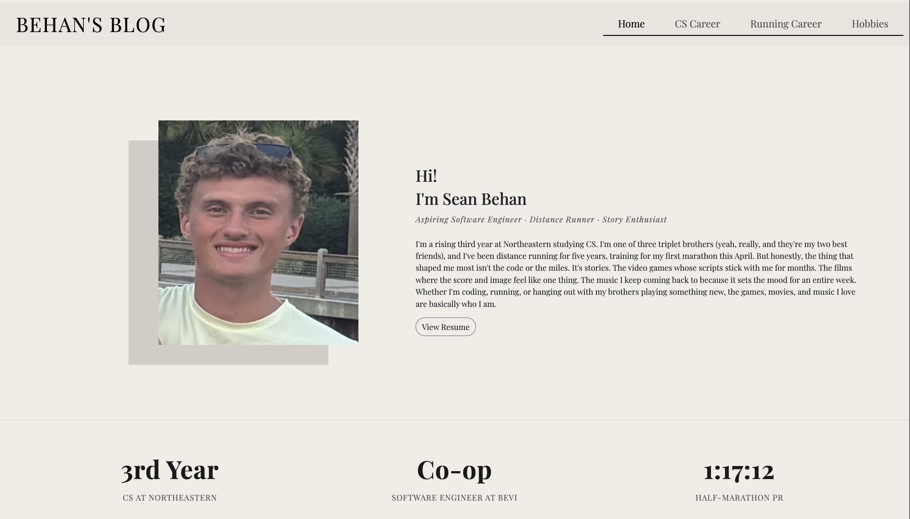

# Sean Behan's Personal Portfolio

My personal portfolio site. Four pages covering my CS work, my running, and the stuff I get obsessed with outside of both. Built with HTML, CSS, and a little vanilla JavaScript on top of Bootstrap 5.

**Live site:** https://swbehan.github.io/sean-behan-website/

---

## Author

**Sean Behan**

- Email: swbehan@gmail.com
- GitHub: [@swbehan](https://github.com/swbehan)
- LinkedIn: [Sean Behan](https://www.linkedin.com/in/sean-behan-/)

---

## Class Link

[Web Development at Northeastern University](https://johnguerra.co/classes/webDevelopment_online_summer_2026/)

---

## Project Objective

I wanted one place to send people when they ask what I'm up to. Recruiters mostly care about my CS work. Friends usually care about something else entirely. Instead of cramming all that into one page, the site splits into four so you can go where you actually want.

Here's what's on each page:

| Page              | What's there                                                                              |
| ----------------- | ----------------------------------------------------------------------------------------- |
| `index.html`      | Homepage. Intro, quick highlights, photo carousel, and links into the rest of the site.   |
| `experience.html` | CS career. Co-op work, six projects with demo videos, AI workflow, and where I'm headed.  |
| `running.html`    | Running career. High school start, the full timeline, PRs, and Northeastern Club Running. |
| `hobbies.html`    | The games, movies, and music I keep coming back to.                                       |

Beyond the content, I wanted to actually write a site from scratch rather than grab a template. No framework. No build step. Just HTML and CSS with a sprinkle of JavaScript. The flip cards on the projects section, the vinyl records that spin on hover, the scroll-driven name reveal on the homepage. All of that is hand-built.

---

## Screenshot



---

## Instructions to Build

This is a static site, so there's no build step.

### View locally

Clone the repo, then either open `index.html` directly or serve the directory with a static server.

```bash
git clone git@github.com:swbehan/sean-behan-website.git
cd sean-behan-website

# Option A: open the file directly in your browser
open index.html

# Option B: serve with Python (recommended, since some asset paths are absolute)
python3 -m http.server 8000
# then visit http://localhost:8000
```

### Development tooling (optional)

The repo includes dev dependencies for linting and formatting:

```bash
npm install
npx eslint js/
npx prettier --check .
npx prettier --write .
```

---

## Tech Stack

- HTML5 with semantic structure
- CSS3 written by hand, using `clamp()` for responsive sizing
- Vanilla JavaScript (ES6 modules) for the scroll animations
- Bootstrap 5.3.8 from CDN for the grid system
- Playfair Display from Google Fonts as the primary typeface

---

## Project Structure

```
sean-behan-website/
├── index.html              # Homepage
├── experience.html         # CS career
├── running.html            # Running career
├── hobbies.html            # Hobbies (see GenAI section)
├── css/styles.css          # All site styles
├── js/                     # Per-page JS modules
│   ├── main.js             #   homepage scroll + carousel
│   ├── experience.js       #   message bubble fade-in
│   ├── running.js          #   footprints + timeline + stat cards
│   └── hobbies.js          #   vinyl slide-in + timeline cards
├── images/                 # Photography, logos, cover art, favicon
├── videos/                 # Project demos (compressed for web)
├── pdf/                    # Resume
├── design/                 # Design document and mockups
├── claude/                 # GenAI prompts (see GenAI section)
├── eslint.config.mjs       # ESLint flat config
├── package.json            # Dev dependencies (ESLint, Prettier)
└── LICENSE                 # MIT
```

---

## Use of GenAI

I used Claude (Anthropic's AI assistant, accessed through Claude Code in the terminal) to generate one page of this site: `hobbies.html`.

### Model

Claude Opus 4.7 (1M context), via Claude Code.

### How it was used

First I wrote three content markdown files describing my favorite video games, my favorite films, and the artists I keep coming back to. Those live in the `claude/` folder:

- [`claude/favorite-games.md`](claude/favorite-games.md)
- [`claude/favorite-movies.md`](claude/favorite-movies.md)
- [`claude/favorite-music.md`](claude/favorite-music.md)

Then I wrote a single creation prompt at [`claude/page-creation.md`](claude/page-creation.md). The prompt told Claude to build `hobbies.html` by matching the existing pages I'd already written by hand. I specifically asked it to reuse my existing CSS classes and color palette instead of inventing new ones. I also asked it to pull the actual content out of the favorites files and to generate a matching `hobbies.js` for the scroll animations.

### Prompt

The full prompt is at [`claude/page-creation.md`](claude/page-creation.md). The core of it was:

> Create hobbies.html following the exact same structure, styling, and component patterns as experience.html, running.html, and index.html. Use the shared styles.css file and link to a new hobbies.js file. Use the same color palette, same font (Playfair Display), same Bootstrap grid system, same clamp() responsive sizing approach, and same scroll-triggered animation patterns. For the content of the pages, reference claude/favorite-games.md, claude/favorite-music.md, claude/favorite-movies.md.

### What was not AI-generated

Everything else. The three other HTML pages, the design document, the photography, the videos, all the running and CS content, the underlying CSS framework that the hobbies page just reused. The AI's role was scoped to scaffolding one page using my content and my existing design system as a template.

---

## Resources

MDN docs I leaned on while writing the CSS:

- [`@media`](https://developer.mozilla.org/en-US/docs/Web/CSS/@media) for the mobile breakpoints
- [`clamp()`](https://developer.mozilla.org/en-US/docs/Web/CSS/clamp) for fluid responsive sizing without writing media queries everywhere
- [`transform`](https://developer.mozilla.org/en-US/docs/Web/CSS/transform) for the flip cards and the vinyl record spin
- [`transition`](https://developer.mozilla.org/en-US/docs/Web/CSS/transition) for smooth hover effects
- [`@keyframes`](https://developer.mozilla.org/en-US/docs/Web/CSS/@keyframes) for the slide-down animations
- [`animation`](https://developer.mozilla.org/en-US/docs/Web/CSS/animation) (shorthand) for applying those keyframes

---

## Credits & Attributions

- **Bevi®** — Logo and video referenced for portfolio purposes only. All rights belong to Hydration Labs, Inc. (Bevi®). Formal permission recieved.
- **TypeScript, Android Studio, CircleCI, and Claude** — Logos are trademarks of their respective owners and are used here for portfolio reference purposes only.
- **Game cover art and images on Hobbies Page** — Are the property of their respective publishers. Used here for portfolio reference purposes only.
- **Timeline component** — The double-sided timeline on the running and hobbies pages is adapted from [MDBootstrap's timeline template](https://mdbootstrap.com/docs/standard/extended/timeline/). The base CSS for the vertical line and the alternating card layout came from there. The content and color tweaks are mine.

---

## License

MIT. See the [LICENSE](LICENSE) file.
